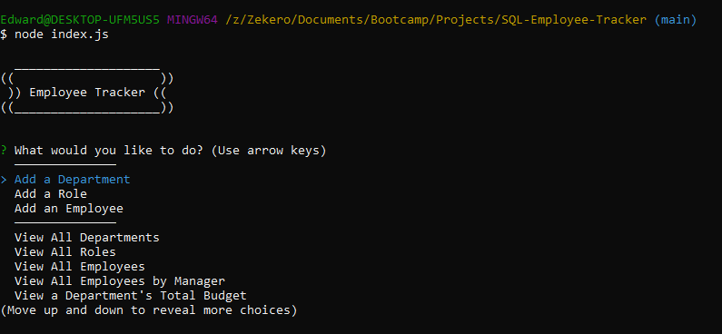
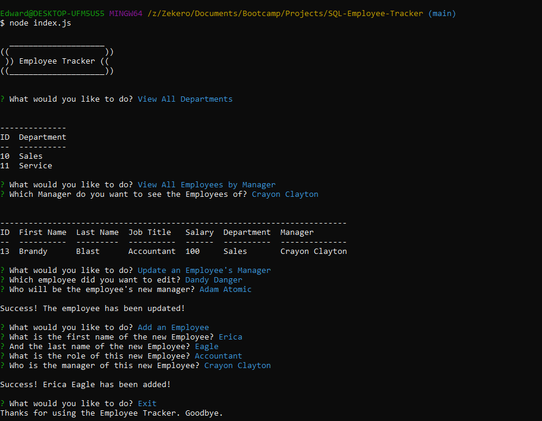

# SQL Employee Tracker

This is a mySQL practice CLI application. Within the console, the user is able to perform CRUD opertaions against three joined tables. It utilizes the Inquirer.js package to prompt for user input and cycling through the options. Also inside is the console.table package to help create a better looking table within the console.

[Demo Video](https://youtu.be/w_9w_-zfR74)

## Table of Contents
* [Installation](#installation)
* [Usage](#usage)
* [Contributors](#contributors)
* [Questions](#questions)
* [License](#license)

# Installation
Users must download SQL and any SQL gui such as TablePlus in addition to the necessary file located in this repository. Users must then reconfigure the connection.js file within the config folder to match the user's SQL connection information. Users must also set up the database via the SQL gui of choice by running the employee_tracker_schema.sql file. Running the seed.sql file inside the gui is optional, if only the user wishes to pre-load some data into the tables. Finally, the user has to install the node packages via 'npm install' from their console of choice.
# Usage

To use the program, the user should locate the folder directory within their console of choice. Then by running 'node index.js' the user can start the program. The user is brought to the main menu where a variety of CRUD operations are available to perform.

# Contributors
Thanks to the following people who have contributed to this project:

* [Scott Byer](https://github.com/switch120) 
* [Mike Fearly](https://michaelfearnley.com/)
* UNH Full Stack Development Bootcamp

# Questions
You can find me at my [github page here](https://github.com/ejhuang2015).
Any comments, questions, or concerns? Email me  at ejhuang.2015@gmail.com.

# License

### Copyright (c) [2021] [ejhuang2015]
View the license in [license.txt](./license.txt)
